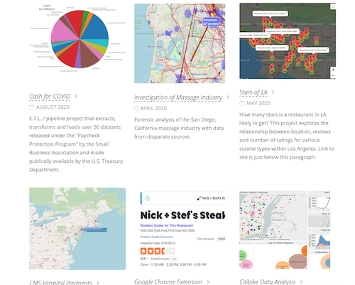

## Portfolio site for GitHub pages
Displaying 9 projects, a short bio and sharing some favorite data talks. 

### Fixed header and bio section

### Set up to display 9 projects

### Languages
- HTML
- CSS

### File structure and deployment
Site was developed using Bootstrap 4 for basic structure and includes several CSS files which override a signficant amount of styling. 

The "download as template" option is enabled in this repository.

Depoloyed on GitHub pages: <a href =  "https://sherirosalia.github.io/sherirosalia.io/" > Sheri Rosalia</a>.

